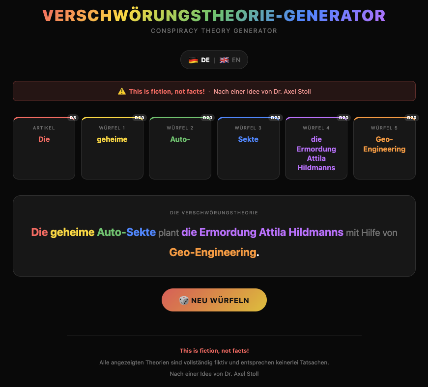

# Verschwörungstheorie-Generator · Conspiracy Theory Generator

A single-page web app that rolls five D20 dice server-side on every page load and assembles an absurdist conspiracy theory — in German and English. Inspired by Dr. Axel Stoll.



> **This is fiction, not facts!**

---

## How it works

| Die | Role | Example |
|-----|------|---------|
| Article (D3) | Der / Die / Das — chosen independently of grammatical gender | *Die* |
| Würfel 1 (D20) | Adjective | *geheime* |
| Würfel 2 (D20) | Compound prefix | *Auto-* |
| Würfel 3 (D20) | Noun (fused directly to prefix) | *Sekte* |
| Würfel 4 (D20) | Object — what is being plotted | *die Weltherrschaft* |
| Würfel 5 (D20) | Means / instrument | *Chemtrails* |

**German sentence structure:**
> `[Article] [D1] [D2][D3] plant [D4] mit Hilfe von [D5].`

**English sentence structure:**
> `The [D1] [D2][D3] is plotting [D4] with the help of [D5].`

A random dark colour theme (one of eight) is chosen server-side with each roll. The language toggle (DE / EN) switches client-side with no page reload; the preference is persisted via `localStorage`.

---

## Running locally

```bash
pip install flask
python app.py
# Open http://localhost:5000
```

Or with Docker:

```bash
docker compose up --build
# Open http://localhost:5000
```

---

## Running tests

```bash
pip install pytest
pytest
```

17 tests covering dice data integrity, Flask route behaviour, HTTP headers, theming, and bilingual content.

---

## Project structure

```
ct-generator/
├── app.py                  # Flask app — single GET / route
├── dice.py                 # All dice data (DE + EN)
├── templates/
│   └── index.html          # Jinja2 template — bilingual, pre-rendered
├── static/
│   └── style.css           # All styles incl. 8 dark theme classes
├── tests/
│   ├── test_app.py         # Flask integration tests
│   └── test_dice.py        # Dice data integrity tests
├── Dockerfile
├── docker-compose.yml
└── requirements.txt
```

---

## Tech stack

- **Python 3.12** · **Flask 3** · **Jinja2** — server-side rendering, no build step
- **Vanilla JS** — language toggle only, no framework
- **CSS custom properties** — theming via body class set server-side

---

## License

MIT — see [LICENSE](LICENSE).

*Nach einer Idee von Dr. Axel Stoll*
